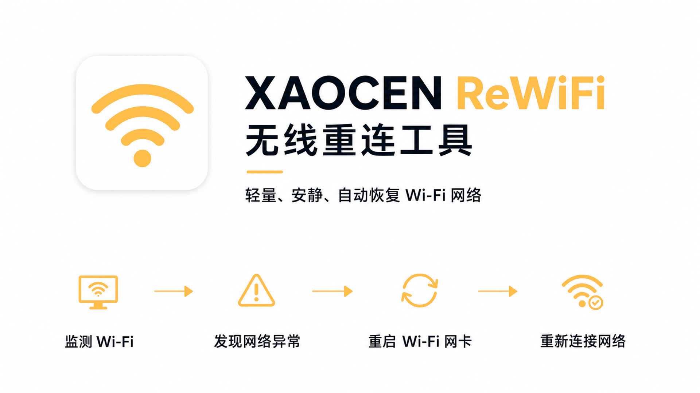

# XAOCEN ReWiFi v2.0



中文名称：**无线重连**

XAOCEN ReWiFi 无线重连工具

用于持续监测 Windows 当前 Wi‑Fi 状态，并在网络异常时自动重启 Wi‑Fi 与重新连接。

专注于稳定、安静的后台运行，让重要的网络任务保持顺畅进行。

XAOCEN ReWiFi 是一个轻量的 Windows Wi‑Fi 自动恢复托盘工具。它持续读取 Windows 自己维护的网络状态，在指定 Wi‑Fi 出现持续异常时，自动关闭并重新开启 Wi‑Fi 网卡，然后连接 Windows 已保存的 Wi‑Fi Profile。

程序不保存 Wi‑Fi 密码，不管理代理软件。v2.0 按 Account 协议访问 `auth.xaocen.studio`；访问令牌只保存在内存，刷新令牌和离线设备私钥保存在 Windows Credential Manager，不写入配置文件、日志或普通明文文件。

> v1.5 为稳定归档版本。v2.0 在同一版本内接入 XAOCEN Account：网络可用时优先在线校验，网络不可用时自动回退到本地离线签名校验。账号登录由 XAOCEN Account 官网完成，ReWiFi 不重复实现邮箱或第三方登录。客户端不采集匿名遥测。

GitHub 项目主页：[siycaoxgh/xaocen-rewifi](https://github.com/siycaoxgh/xaocen-rewifi)

## 功能概览

程序启动后隐藏主窗口，仅在 Windows 托盘运行：

```text
监测指定 Wi‑Fi
      ↓
异常持续 5 秒
      ↓
关闭 Wi‑Fi 网卡
      ↓
等待 2 秒并重新开启
      ↓
等待 3 秒后连接已保存的 Wi‑Fi
      ↓
进入 30 秒冷却并继续监听
```

设置窗口顶部使用 ReWiFi 图标和流程说明，完整产品介绍页面使用 XAOCEN ReWiFi 品牌演示图。

## 环境

- Windows 10 / Windows 11
- .NET 10 SDK
- WinForms

程序需要管理员权限，因为恢复流程需要启用或禁用 Wi‑Fi 网卡。开机启动使用 Windows 任务计划程序，并以最高权限运行。

## 跨电脑使用要求

独立 EXE 可以直接复制到其他电脑，但不适用于所有设备：

- 支持 Windows 10 / Windows 11；
- 目标电脑应为 Intel/AMD x64 架构；
- 运行时需要允许管理员权限；
- 目标电脑必须存在可用的 Wi‑Fi 网卡；
- 目标 Wi‑Fi 必须先在该电脑上手动连接，并由 Windows 保存 Profile。

不支持安卓手机、iPhone、macOS、Linux 等非 Windows 设备。移动 EXE 不会携带原电脑的配置；换到新电脑后，需要重新设置目标 Wi‑Fi 和网卡名称，开机启动任务也需要在新电脑重新创建。

## 编译

```powershell
dotnet build .\XAOCEN-WiFiFix.sln -c Release
```

发布为压缩的独立单文件 EXE：

```powershell
dotnet publish .\src\WiFiFix\WiFiFix.csproj -c Release -r win-x64 --self-contained true -p:PublishSingleFile=true -p:IncludeNativeLibrariesForSelfExtract=true -p:EnableCompressionInSingleFile=true -o .\build\v2.0-publish
```

输出文件名为：

```text
XAOCEN.ReWiFi.exe
```

独立版本约 92 MB（约 88 MiB），目标电脑不需要另外安装 .NET 10。当前发布使用 `net10.0-windows`，避免携带不必要的固定 Windows SDK 运行组件；摄像头二维码扫描核心仍保留。

v1.5 回归测试源码按项目归档规则保存在独立的[历史归档仓库测试目录](https://github.com/siycaoxgh/xaocen-rewifi-archive/tree/main/tests)，不随当前主仓库发布。

## 使用

1. 先通过 Windows Wi‑Fi 菜单连接一次目标网络，让 Windows 保存该 Wi‑Fi Profile。
2. 以管理员身份运行 `XAOCEN.ReWiFi.exe`。
3. 右键托盘图标打开“设置”。
4. 点击“自动识别当前连接”，程序会自动填入当前 SSID 和 Wi‑Fi 网卡名称。
5. 保存设置即可。默认异常等待 5 秒、恢复冷却 30 秒、自动恢复和开机启动均开启。

首次启动时程序会优先检查在线产品文档；网络不可用或在线地址无法访问时自动打开本地产品介绍页面。之后可从设置窗口或托盘菜单分别打开在线文档或本地文档；“产品文档（自动选择）”仅作为首次启动行为，不再作为重复按钮显示。

托盘顶部保留产品名称、版本、状态、立即恢复、自动恢复和开机启动；其余入口收纳到“设置”“账号与离线授权”“文档与帮助”和“帮助与反馈”菜单中。设置窗口将账号授权、网络恢复和帮助与文档分为三个区域，同时在 Windows 任务栏显示独立图标，便于从其他窗口后方找回。账号卡片只保留一个“打开授权中心”入口，避免与托盘入口和设置页重复。

## XAOCEN Account 与离线授权（v2.0）

ReWiFi 不在客户端重复实现邮箱或第三方登录，在线账号授权统一跳转 XAOCEN Account 官网完成。设置窗口中的“账号与离线授权”卡片只提供一个“打开授权中心”入口，授权中心集中展示账号会话、ReWiFi 产品权益和离线授权状态。在线会话使用设备授权、刷新、退出和撤销接口：

- 参数固定为 `productId=rewifi`、`platform=windows-x64`；
- 短期访问令牌只保存在内存；
- 刷新令牌保存到 Windows Credential Manager，并在刷新时轮换；
- 服务端错误只记录必要的请求编号，不记录令牌或响应中的敏感内容。
- 登录成功或会话恢复后调用 `GET /v1/account/entitlements`，只展示 `productId=rewifi` 的权益状态，不在客户端创建或修改权益。
- 授权等待期间，授权中心会显示“等待账号批准”、授权截止时间、上次轮询时间、下一次轮询时间、当前轮询次数和授权剩余时间；
- 授权完成后显示“XAOCEN Account 已连接”，以授权中心中的状态为准，浏览器页面可以手动关闭。

需要区分两种状态：左侧“XAOCEN Account 已连接”表示本机已建立可恢复的账号会话；右侧“离线授权联网校验通过”表示当前离线授权文件和设备状态已通过 Account 服务端核验。离线授权联网校验不会自动建立账号登录会话，二者可以独立存在。设置页和授权中心会同步显示最近一次检查模式、权益到期、下次联网检查和最迟重新授权日期。

离线授权使用同一版本的本地回退路径：

1. 在设置中复制本机生成的 Ed25519 离线设备公钥；
2. 由已登录 XAOCEN Account 的联网设备申请离线授权；
3. 将服务端签发的 `.xaocen-license` 文件带回 ReWiFi 并导入；
4. 客户端内置 `primary` 公钥，校验签名、产品、平台、设备公钥摘要和时间策略；
5. 可以显示设备公钥二维码，供联网手机或 Account 网页扫描；
6. 可以扫描 Account 返回的 `compactLicense` 授权二维码，也可以继续使用字符串或文件导入；
7. 网络可用时调用 Account 离线检查/重新签发接口，网络失败时不把网络故障误判为签名无效，继续使用本地有效授权。

扫描授权二维码需要 Windows 摄像头访问权限；摄像头不可用或未授权时，可以继续使用授权字符串粘贴或 `.xaocen-license` 文件导入。

针对低像素电脑摄像头，Account 授权二维码使用更大的显示尺寸，ReWiFi 扫描端也会自动尝试灰度、二值化和放大识别；如果仍无法识别，优先使用授权字符串或文件导入。

详细的客户端与 Account 项目边界、密钥位置和联调步骤见[授权接入分工与联调清单](授权接入分工与联调清单.md)。

离线设备私钥只保存在 Windows Credential Manager。当前实现使用 Account API 已确认的 `compactLicense` 规范和 `primary` 公钥；在线优先、本地回退和二维码传输均为正式客户端能力。

## 网络判断

程序每 2 秒读取指定无线网卡的本地 Windows 状态，正常时不主动访问互联网。Windows 状态异常持续设置的秒数后，程序才会并行执行两个轻量 HTTPS 探测：

- Google 与百度都可达：认为外网正常，不重启 Wi‑Fi。
- 一个可达、一个不可达：可能是代理规则或代理链路问题，不重启 Wi‑Fi。
- 两个都不可达：认为实体 Wi‑Fi 可能异常，执行一次 Wi‑Fi 恢复。
- Wi‑Fi 物理断开、SSID 消失或网卡禁用：直接进入恢复流程。

程序不会操作代理软件。探测只读取响应状态，不保存网页内容、Cookie、账号、Token 或密码。

Google 和百度探测使用直连，并明确绕过系统代理以及 `HTTP_PROXY`、`HTTPS_PROXY`、`ALL_PROXY` 环境变量，避免代理端口故障污染 Wi‑Fi 判断。

## 日志与配置

托盘菜单提供“查看运行日志”。

日志文件：

```text
%LOCALAPPDATA%\XAOCEN ReWiFi\runtime.log
```

配置文件：

```text
%LOCALAPPDATA%\XAOCEN ReWiFi\config.json
```

离线授权文件：

```text
%LOCALAPPDATA%\XAOCEN ReWiFi\offline-license.xaocen-license
```

账号刷新令牌和离线设备私钥不在普通文件中，分别保存在当前 Windows 用户的 Credential Manager：

```text
XAOCEN.ReWiFi/auth.xaocen.studio
XAOCEN.ReWiFi/offline-device-key
```

从 v1.7 升级到 v1.8.x 时，这些路径和凭据名称保持不变，因此新 EXE 会自动读取原来的配置、离线授权文件、账号刷新令牌和设备私钥，不会因为替换程序文件而重新生成。导入新的离线授权会覆盖旧授权文件；退出账号或撤销设备会删除账号刷新令牌；换电脑、换 Windows 用户或离线设备私钥损坏时，不能直接沿用原设备授权。

本地产品介绍页面：

```text
%LOCALAPPDATA%\XAOCEN ReWiFi\XAOCEN-ReWiFi-介绍.html
```

## 限制

目标 Wi‑Fi 必须已经由当前 Windows 用户保存过 Profile。Google 或百度可能受到代理规则、域名策略或服务故障影响，因此“一成功一失败”只记录为部分可达，不会据此重启 Wi‑Fi。

## 更新日志

### v1.5 · 2026-08-22

- 修复 `WifiController.IsAdministrator()` 在正式发布包中缺少 `System.Security.Principal.Windows` 程序集、导致自动恢复流程异常的问题。
- 固化 `win-x64` self-contained 单文件发布配置，并核对正式发布包的依赖完整性。
- 修复连通性探测继承本机代理的问题，探测现在绕过系统代理、`HTTP_PROXY`、`HTTPS_PROXY` 和 `ALL_PROXY` 环境变量。
- 增加回归测试，覆盖代理端口不可用、真实不可达、直连处理器和 Windows 权限程序集加载场景。
- 补充跨电脑运行要求、架构限制、管理员权限和配置不随 EXE 携带的说明。
- 保留 v1.4 至 v0.1 的历史更新记录，并将本次工程修复、测试和发布结果记录为 v1.5。

### v1.4 · 2026-08-22

- 全面应用 XAOCEN 品牌色彩规范。
- 使用新版 `xaocen-rewifi.png` 作为本地产品介绍页主视觉。
- 统一橙黄、青靛、天蓝、青灰和中性色的使用职责。
- 更新设置窗口的背景、按钮、链接、文字和容器颜色。
- 更新本地 HTML 产品介绍页面的配色、主视觉和完整使用说明。
- 补充日志目录、配置目录、本地介绍页目录、编译和使用说明。
- 固定跨版本单实例互斥名称，避免旧版和新版同时操作 Wi‑Fi 网卡。
- 增加 GitHub 安全排除规则，避免本地配置、运行日志和构建产物进入仓库。
- 固化 win-x64 self-contained 单文件发布配置，确保 Windows 权限检测程序集随正式发布包携带。
- 修复连通性探测继承系统代理的问题，Google 和百度探测现在明确绕过系统代理与代理环境变量。
- 增加代理不可用、真实不可达和 Windows 权限程序集加载的回归测试。
- 保留 v1.3 至 v0.1 的历史更新记录，并补充 v1.4 当前版本说明。

### v1.3 2026-08-21

- 应用名称更新为 `XAOCEN ReWiFi`。
- 中文名称确定为“无线重连”。
- 统一应用、程序集、文件属性、托盘菜单、日志和任务计划程序版本为 `1.3`。
- 替换 EXE、快捷方式和托盘使用的 ReWiFi 圆角图标。
- 在设置窗口加入图标和自动恢复流程说明，让无主窗口的托盘程序也能直观展示工作方式。
- 新增独立产品介绍文案，统一应用介绍、版本和开发者信息。
- 设置窗口功能展示区改为完整产品介绍，并加入 GitHub 项目主页链接。
- 开机任务更名为 `XAOCEN ReWiFi`，并自动清理旧的 `XAOCEN WiFiFix` 任务。
- 自动迁移旧版本地配置，保留已设置的 SSID、网卡、等待时间和恢复选项。
- 保留实体 Wi‑Fi 网卡判断、Google/百度 HTTPS 辅助判断、恢复冷却和运行日志功能。

### v1.2 2026-08-15

- 完善运行日志、开机任务、配置保存和网络异常恢复流程；加入连通性探测相关功能。
- 开机任务自动创建和更新。
- 从旧版配置目录自动迁移配置。
- 解决旧版任务仍指向历史 EXE 的问题。
- 修复日志乱码问题。

### v1.1 2026-08-12

- Wi‑Fi 断开或无 Internet 时自动恢复。
- Wi‑Fi 已连接但 Google、百度均不可达时自动重连。
- 一个网站可达、另一个不可达时，不立即重启，避免误伤代理链路。
- 运行日志和托盘“查看运行日志”。
- 自动识别当前 SSID 和 Wi‑Fi 网卡。
- 单实例运行，防止多个后台程序同时操作网卡。

### v1.0 2026-08-11

- 完善运行日志、开机任务、配置保存和网络异常恢复流程；加入连通性探测相关功能。
- 诊断日志版本，增加启动路径、PID、任务路径和运行状态记录。
- 日志编码和乱码相关修正版。
- 加入 Google、百度连通性辅助判断。
- 针对网络探测、恢复流程、开机任务和稳定性进行修正。

### v0.1 2026-08-10

- 基础功能：托盘常驻、单实例、配置文件、管理员权限、Wi‑Fi 自动关闭/开启/重连、异常等待、恢复冷却、开机启动。
